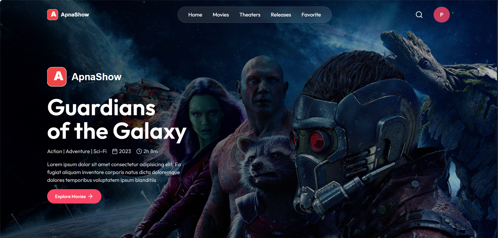
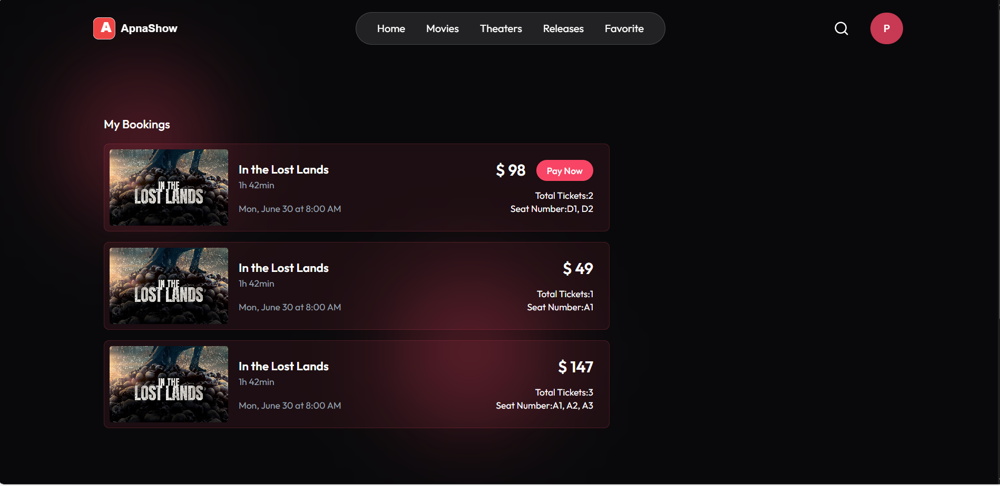
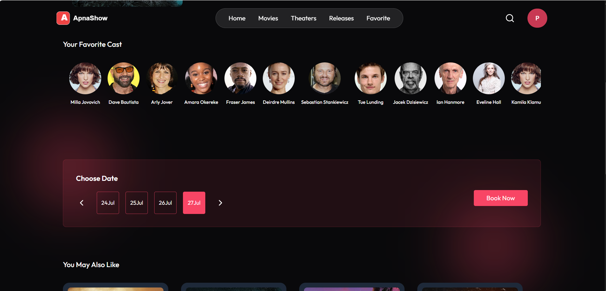
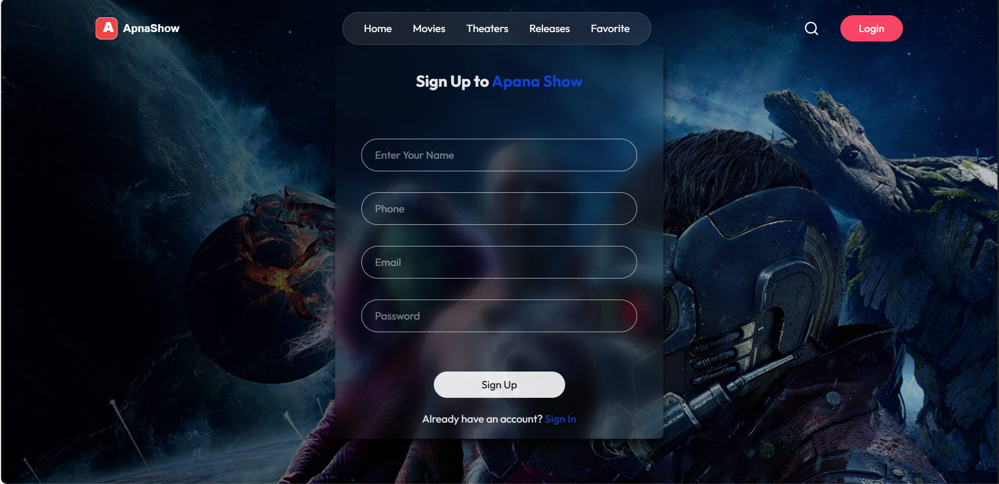
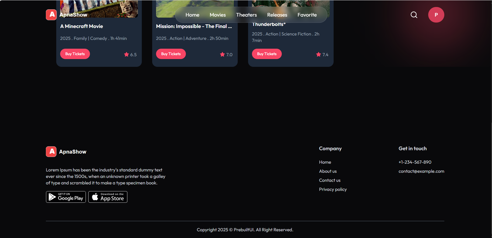
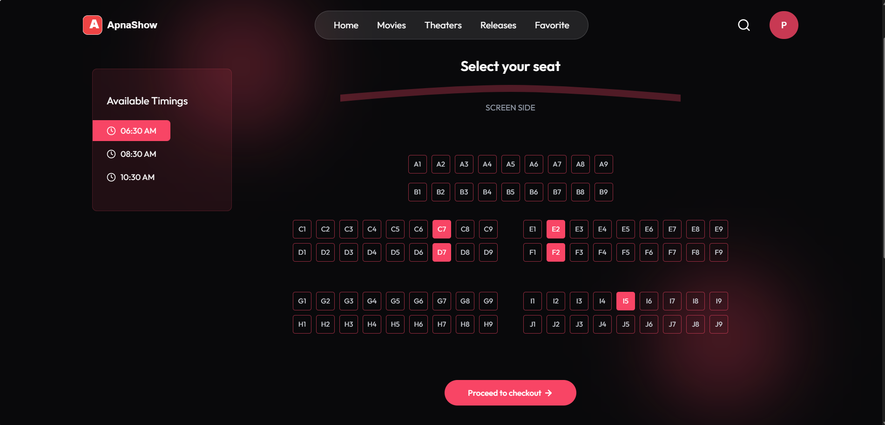

<p align="center">
   
</p>

# ApnaShow Movie Web

A modern movie web application built with React and Vite. This project allows users to browse movies, view trailers, book seats, and manage favorites.

<p align="Started">
   
</p>

<p align="center">
   
</p>

## Features
- Browse movies and view details
- Watch trailers directly in the app
- Book seats for shows
- Manage favorite movies
- Responsive design for all devices

## Getting Started

### Prerequisites
- Node.js (v16 or above recommended)
- npm or yarn

### Installation
1. Clone the repository:
   ```sh
   git clone https://github.com/Kamleshkumawt/ApnaShow-Movie-Web.git
   ```
2. Navigate to the project folder:
   ```sh
   cd ApnaShow-Movie-Web/client
   ```
3. Install dependencies:
   ```sh
   npm install
   # or
   yarn install
   ```

### Running the App
```sh
npm run dev
# or
yarn dev
```
The app will be available at `http://localhost:5173` by default.

## Folder Structure
```
client/
  src/
    components/   # Reusable UI components
    pages/        # Main pages (Home, Movies, etc.)
    assets/       # Images, icons, and static assets
    routes/       # App routing
    lib/          # Utility libraries
server/           # Backend (if implemented)
```

## Contributing
1. Fork the repository
2. Create your feature branch (`git checkout -b feature/AmazingFeature`)
3. Commit your changes (`git commit -m 'Add some AmazingFeature'`)
4. Push to the branch (`git push origin feature/AmazingFeature`)
5. Open a Pull Request

## License
This project is licensed under the MIT License.


## Image Assets

Below are all PNG images used in the project (located in `client/src/assets/`):


<p align="center">
   
   
   
   
   
   
   
</p>

You can use these images for documentation, UI, or branding purposes.

## Contact
Created by Kamlesh Kumawat. For questions, open an issue or contact via GitHub.
